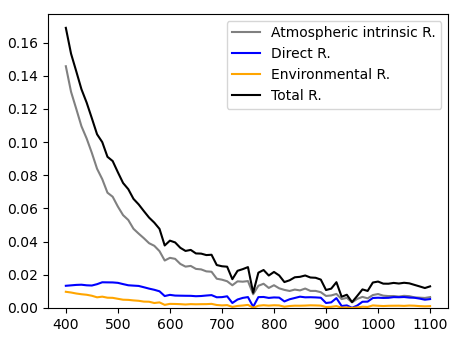

# Instruction - Advanced Modelling

This page introduces spectral and 3D radiative-transfer calculations. 


## Be creative at what you can do! 

You can do lots of things with T-Mart! E.g.:

- Load your own DEM and image (they have to be the same size),
- Loop through wavelengths, distances from shore, AOT, viewing or solar angles, etc. 


## Built-in surface types 

T-Mart currently provides four built-in spectral surface types: soil, vegetation, water and water with a chlorophyll concentration of 1 µg/L. For example: 


```python
# Create object
water = tmart.SpectralSurface('water_chl1')

# Find spectral reflectance at 400nm
water.wl(400)

# Create a spectral surface in a numpy array 
wl = 400 # your variable in a loop
np.full((2, 2), water.wl(wl))
```

## Case study: a typical ocean-colour observation 

Here we model a typical hyperspectral ocean-colour observation with the following parameters: 

- View zenith = 30°
- Solar zenith = 30°
- View azimuthal = 90° (to minimize sun-glint)
- Windspeed = 10 m/s
- Atmosphere profile: mid-latitude summer
- Aerosol profile: maritime aerosols 
- AOT550: 0.1 
- Water salinity: 35 parts per thousand
- Water temperature: 20 C
- Water chl-a concentration: 1 µg/L

Water's specular reflectance is calculated following Cox&Munk slope statistics. 

We loop through wavelengths 400 to 1100nm at an interval of 10nm, use a Python list to collect the reflectances at each wavelength, convert it to a Pandas dataframe, and plot the reflectances with the *matplotlib* package:

```python
import tmart
import numpy as np
import pandas as pd
from Py6S.Params.atmosprofile import AtmosProfile

if __name__ == "__main__":
	water = tmart.SpectralSurface('water_chl1')
	
	# Master output
	pd_output = []
	
	# Specify wavelength in nm
	wavelengths = range(400,1110,10)
	
	for wl in wavelengths:
	
	    ### DEM and reflectance ###
	    
	    # Three same-size numpy arrays are needed
	    image_DEM = np.full((2, 2), 0) # in meters
	    image_reflectance = np.full((2, 2), water.wl(wl)) # unitless       
	    image_isWater = np.full((2, 2), 1) # 1 is water, 0 is land
	    
	    # pixel width and length, in meters 
	    cell_size = 20_000 
	    
	    # Synthesize a surface object
	    my_surface = tmart.Surface(image_DEM,image_reflectance,image_isWater,cell_size)  
	    # Set background information, 1 or 2 background surfaces can be set;
	    # If 2: the first background is the one closer to [0,0]
	    my_surface.set_background(bg_ref        = [water.wl(wl),water.wl(wl)], 
	                              bg_isWater    = [1,1], # water
	                              bg_elevation  = 0, # elevation of both background
	                              bg_coords     = [[0,0],[10,10]]) # a line dividing two background                                    
	    
	    ### Atmosphere ###
	    
	    # Atmophere profile comes from 6S
	    atm_profile = AtmosProfile.PredefinedType(AtmosProfile.MidlatitudeSummer) 
	    aerosol_type = 'Maritime' 
	    aot550 = 0.1
	    n_layers = 20
	    aerosol_scale_height = 2 # in km
	    
	    # Synthesize an atmosphere object    
	    my_atm = tmart.Atmosphere(atm_profile, aot550, aerosol_type, n_layers, aerosol_scale_height)   
	        
	    ### Running T-Mart ###
	    
	    # Make a T-Mart object 
	    my_tmart = tmart.Tmart(Surface = my_surface, Atmosphere= my_atm, shadow=False)
	    my_tmart.set_wind(wind_speed=10, wind_azi_avg = True)
	    my_tmart.set_water(water_salinity=35, water_temperature=20)
	    
	    # Specify the sensor's position (x, y, z), viewing direction relative 
	    # to the sensor (zenith, azimuth), sun's direction relative to the target 
	    # (zenith, azimuth)
	    my_tmart.set_geometry(sensor_coords=[51,50,130_000], 
	                          target_pt_direction=[150,90],
	                          sun_dir=[30,0])
	    
	    # Run
	    n_photon = 10_000
	    results = my_tmart.run(wl=wl, n_photon=n_photon)
	    
	    # Calculate reflectances using recorded photon information 
	    R = tmart.calc_ref(results)
	    
	    for k, v in R.items():
	        print(k, '     ' , v)
	        
	    # Add wavelength and append to output 
	    R['Wavelength'] = wl
	    pd_output.append(R)
	
	pd_output = pd.DataFrame(pd_output)
	
	# Plot 
	import matplotlib.pyplot as plt
	
	plt.plot(pd_output["Wavelength"], pd_output["R_atm"], color='grey', label='Atmospheric intrinsic R.')
	plt.plot(pd_output["Wavelength"], pd_output["R_dir"], color='blue', label='Direct R.')
	plt.plot(pd_output["Wavelength"], pd_output["R_env"], color='orange', label='Environmental R.')
	plt.plot(pd_output["Wavelength"], pd_output["R_total"], color='black', label='Total R.')
	plt.ylim(ymin=0)
	
	plt.legend()
	plt.show()
```

Output: 



There is non-negligible reflectance in the NIR range, and that comes from glint and foam reflectance at a wind speed of 10 m/s.

Note that because T-Mart runs wavelength by wavelength and Monte-Carlo solvers are usually slower than other numerical solvers, the code above may take over 10 minutes to run. 

## Case study: adjacency-effect modelling 

Here I demonstrate a simple straight-line-coast adjacency-effect modelling using two built-in spectral libraries in T-Mart, *water_chl1* and *vegetation*, representing ocean water with a chlorophyll concentration of 1 mg/m<sup>3</sup> and land of vegetation, respectively. 


Modelling of the adjacency effect at 800 nm, 1000 m from the shore: 


Note that the coast extends to infinity in the modelling by setting the background in T-Mart. The blue line is the surface normal sampled from Cox-Munk slope statistics. The colour of the dark triangles represents the low reflectance of water at 800 nm.


```python
import tmart
import numpy as np
from Py6S.Params.atmosprofile import AtmosProfile

# Specify wavelength in nm
wl = 800

# Distance to shore in m 
dist = 1000

# Built-in spectral libraries 
water = tmart.SpectralSurface('water_chl1')
vegetation = tmart.SpectralSurface('vegetation')


### DEM and reflectance ###

# Three same-size numpy arrays are needed
image_DEM = np.full((2, 2), 0) # in meters
image_reflectance = np.array([[vegetation.wl(wl),vegetation.wl(wl)],
                              [water.wl(wl),water.wl(wl)]]) 
image_isWater = np.array([[0,0],[1,1]])

# pixel width and length, in meters 
cell_size = 20_000

# Synthesize a surface object
my_surface = tmart.Surface(image_DEM,image_reflectance,image_isWater,cell_size)  
# Set background information, 1 or 2 background surfaces can be set;
# If 2: the first background is the one closer to [0,0]
my_surface.set_background(bg_ref        = [vegetation.wl(wl),water.wl(wl)], 
                          bg_isWater    = [0,1], # water
                          bg_elevation  = 0, # elevation of both background
                          bg_coords     = [[0,20_000],[40_000,20_000]]) # a line dividing two background                                    

### Atmosphere ###

# Atmophere profile comes from 6S
atm_profile = AtmosProfile.PredefinedType(AtmosProfile.MidlatitudeSummer) 
aerosol_type = 'Maritime' 
aot550 = 0.1

# Synthesize an atmosphere object    
my_atm = tmart.Atmosphere(atm_profile, aot550, aerosol_type)   

### Running T-Mart ###

# Make a T-Mart object 
my_tmart = tmart.Tmart(Surface = my_surface, Atmosphere= my_atm, shadow=False)
my_tmart.set_wind(wind_speed=10, wind_azi_avg = True)
my_tmart.set_water(water_salinity=35, water_temperature=20)

# Specify the sensor's position (x, y, z), viewing direction relative 
# to the sensor (zenith, azimuth), sun's direction relative to the target 
# (zenith, azimuth)
my_tmart.set_geometry(target_coords=[30000,20000+dist], 
                      target_pt_direction=[150,0],
                      sun_dir=[30,90])  

# Run single photon and plot 
# results = my_tmart.run_plot(wl=wl, plot_on=True, plot_range=[0,100_000,0,100_000,0,100_000])

if __name__ == "__main__":
    
    n_photon = 100_000
    results = my_tmart.run(wl=wl, n_photon=n_photon)
    
    # Calculate reflectances using recorded photon information 
    R = tmart.calc_ref(results, detail=True)
    
    for k, v in R.items():
        print(k, '     ' , v)
```

You might want to edit parameters in the code to suit your needs, important parameters include wavelength, distance to shore, aerosol type and AOT, solar and viewing geometry, etc. One can also import imagery as numpy array to model more complex shorelines and surfaces. 


## 3D surfaces 

To simulate non-flat surfaces, all we need to do is to have non-zero values in the DEM array. Users can import DEMs from rasters through geo-processing packages such as GDAL. For example, 

```python
image_DEM = np.array([[30_000,20_000],[5_000,10_000]]) # in meters
```

You can visualize the surface in a single-photon run before calculating the reflective properties of the entire system in a multi-photon run: 


```python
import tmart
import numpy as np
from Py6S.Params.atmosprofile import AtmosProfile

# Specify wavelength in nm
wl = 800

### DEM and reflectance ###

# Three same-size numpy arrays are needed
image_DEM = np.array([[30_000,20_000],[5_000,10_000]]) # in meters
image_reflectance = np.array([[0.5,0.5],[0.5,0.5]])  # unitless     
image_isWater = np.full((2, 2), 0) # 1 is water, 0 is land

# pixel width and length, in meters 
cell_size = 20_000 

# Synthesize a surface object
my_surface = tmart.Surface(DEM = image_DEM,
                           reflectance = image_reflectance,
                           isWater = image_isWater,
                           cell_size = cell_size)  

### Atmosphere ###

# Atmophere profile comes from 6S
atm_profile = AtmosProfile.PredefinedType(AtmosProfile.MidlatitudeSummer) 

# Synthesize an atmosphere object 
my_atm = tmart.Atmosphere(atm_profile)

### Running T-Mart ###

# Make a T-Mart object 
my_tmart = tmart.Tmart(Surface = my_surface, Atmosphere= my_atm)

# Specify the sensor's position (x, y, z), viewing direction relative 
# to the sensor (zenith, azimuth), sun's direction relative to the target 
# (zenith, azimuth)
my_tmart.set_geometry(sensor_coords=[51,50,130_000], 
                      target_pt_direction=[180,0],
                      sun_dir=[0,0])

if __name__ == "__main__":

	# Run and plot on a separate window
	%matplotlib qt
	results = my_tmart.run_plot(wl=wl, plot_on=True, plot_range=[0,100_000,0,100_000,0,100_000])
	
	# Calculate reflectances using recorded photon information 
	R = tmart.calc_ref(results)
	for k, v in R.items():
	    print(k, '     ' , v)
```

Output: 


## Useful information

The following two dataframes completely describe the atmosphere at a single wavelength in T-Mart. 


```python

# Running T-Mart at a specific wavelength will generate 
# an atmosphere at that wavelength in the Tmart object
my_tmart.run(wl=400)

# The atmosphere profile
my_atm_profile = my_tmart.atm_profile_wl

# The aerosol scattering phase function
my_aerosol_SPF = my_tmart.aerosol_SPF_wl
```


The columns of the atmosphere profile:

- Alt_bottom: the bottom the the layer in km.
- Alt_top: the top of the layer in km.
- ot_abs: optical thickness of absroption. 
- ot_rayleigh: optical thickness of molecular or rayleigh scattering. No scattering phase function needed because it is built-in.
- ot_mie: optical thickness of aerosol scattering, relies on the input scattering phase function (see below).
- ot_scatt: sum of ot_rayleigh and ot_mie. 

The columns of the aerosol scattering phase function (currently rely on pre-calculated values, may use miepython in the future to compute on the go):

- Angle: the scattering angle. 
- Value: normalized intensity at the corresponding scattering angle. 

