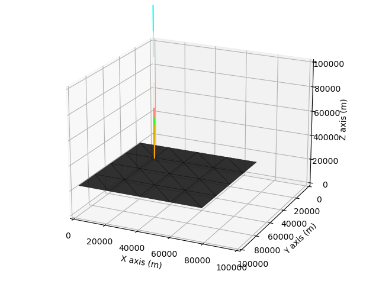

# Instruction - Basic

We start with a simple setting. I will introduce new functions as we go, and have a 'put-together' code at the end. 

This page walks through the input for single-wavelength and flat-surface radiative-transfer calculations. 


## Quick Start

Run T-Mart with simple settings here. 


```python
import tmart
import numpy as np
from Py6S.Params.atmosprofile import AtmosProfile

# Specify wavelength in nm
wl = 400

### DEM and reflectance ###

# Three same-size numpy arrays are needed
image_DEM = np.full((2, 2), 0) # in meters
image_reflectance = np.full((2, 2), 0.1) # unitless     
image_isWater = np.full((2, 2), 0) # 1 is water, 0 is land

# pixel width and length, in meters 
cell_size = 20_000 

# Synthesize a surface object
my_surface = tmart.Surface(DEM = image_DEM,
                           reflectance = image_reflectance,
                           isWater = image_isWater,
                           cell_size = cell_size)  

### Atmosphere ###

# Atmophere profile comes from 6S
atm_profile = AtmosProfile.PredefinedType(AtmosProfile.MidlatitudeSummer) 

# Synthesize an atmosphere object 
my_atm = tmart.Atmosphere(atm_profile)

### Running T-Mart ###

# Make a T-Mart object 
my_tmart = tmart.Tmart(Surface = my_surface, Atmosphere= my_atm)

# Specify the sensor's position (x, y, z), viewing direction relative 
# to the sensor (zenith, azimuth), sun's direction relative to the target 
# (zenith, azimuth), see Parameters for more geometry options
my_tmart.set_geometry(sensor_coords=[51,50,130_000], 
                      target_pt_direction=[180,0],
                      sun_dir=[0,0])

results = my_tmart.run(wl=wl)

# Calculate reflectances using recorded photon information 
R = tmart.calc_ref(results)
for k, v in R.items():
    print(k, '     ' , v)
```

The output should be something like: 

```
========= Initiating T-Mart =========
Number of photons: 10000
Using 10 core(s)
Number of job(s): 80
Wavelength: 400
target_pt_direction: [180, 0]
sun_dir: [0, 0]
=====================================
Tasks remaining = 80
Tasks remaining = 60
Tasks remaining = 38
Tasks remaining = 4
=====================================
Calculating reflectances...
R_atm       0.1268259629342025
R_dir       0.06049548401278206
R_env       0.012567569504188827
R_total       0.1998890164511734
```


## Observing the Movements of a Single Photon

Instead of running lots of photons, we can run a single photon and observe where it goes and what happens. This is mostly for debugging purposes. The details of each movement will be printed. 

We replace Tmart's *run* function with the *run_plot* function here, note that number of photons and multiprocessing are not needed here. 

```python
results = my_tmart.run_plot(wl=wl)
```

We can plot the photon's movements by turnining on *plot_on*: 

```python
results = my_tmart.run_plot(wl=wl, plot_on=True)
```


By default, the limits of X, Y, Z are all 0 to 100,000. We can specify them in the format of [xmin, xmax, ymin, ymax, zmin, zmax]:

```python
results = my_tmart.run_plot(wl=wl, plot_on=True, plot_range=[0,100_000,0,100_000,0,100_000])
```

Lastly, to switch to an interactive plotting mode where you can zoom and rotate the camera interactively, and switch back, use: 

```python
# Interactive mode
%matplotlib qt

# Inline plotting 
%matplotlib inline
```

Putting it all together. We can still calculate reflectances using one photon thanks to the local-estimate technique, but this is not accurate - precise stats come from a large sample size. 

```python
import tmart
import numpy as np
from Py6S.Params.atmosprofile import AtmosProfile

# Specify wavelength in nm
wl = 400

### DEM and reflectance ###

# Three same-size numpy arrays are needed
image_DEM = np.full((2, 2), 0) # in meters
image_reflectance = np.full((2, 2), 0.1) # unitless     
image_isWater = np.full((2, 2), 0) # 1 is water, 0 is land

# pixel width and length, in meters 
cell_size = 20_000 

# Synthesize a surface object
my_surface = tmart.Surface(DEM = image_DEM,
                           reflectance = image_reflectance,
                           isWater = image_isWater,
                           cell_size = cell_size)  

### Atmosphere ###

# Atmophere profile comes from 6S
atm_profile = AtmosProfile.PredefinedType(AtmosProfile.MidlatitudeSummer) 

# Synthesize an atmosphere object 
my_atm = tmart.Atmosphere(atm_profile)

### Running T-Mart ###

# Make a T-Mart object 
my_tmart = tmart.Tmart(Surface = my_surface, Atmosphere= my_atm)

# Specify the sensor's position (x, y, z), viewing direction relative 
# to the sensor (zenith, azimuth), sun's direction relative to the target 
# (zenith, azimuth)
my_tmart.set_geometry(sensor_coords=[51,50,130_000], 
                      target_pt_direction=[180,0],
                      sun_dir=[0,0])

# Run and plot on a separate window
%matplotlib qt
results = my_tmart.run_plot(wl=wl, plot_on=True, plot_range=[0,100_000,0,100_000,0,100_000])
results = np.vstack(results)

# Calculate reflectances using recorded photon information 
R = tmart.calc_ref(results)
for k, v in R.items():
    print(k, '     ' , v)
```

Here's the first plot generated by the code above, the following ones are not shown here. Our input numpy array has a shape of (2,2) but we are seeing 4*4 pixels. This is because the input numpy arrays were padded by 1 layer that connect the input surface to the background in case of an elevation difference between the two. 


There are lines of different colours in the plot: 

- Blue to red: the photon moves from blue to red.
- Green: surface normal of a Lambertian surface.
- Dark blue: surface normal of a specular surface.
- Orange: next moving direction 


## Multiple Processing 

Monte Carlo simulations have inherent noise - it decreases with a larger sample size. Multiprocessing is used to speed up the computation. 

By default, 10,000 photons are used. The number of CPU cores to use is automatic but can be modified. Default number of jobs is 80. Use 100,000 photons for more stable results (it can take up to several minutes for a single computation).


```python
# Number of photons
n_photon = 100_000

# Number of CPU cores to use, sometimes default doesn't work and 
# you need to specify the number of cores you have. 
nc = 10

# Dividing the task into n jobs, I found 80-120 lead to 
# more or less the same processing time. 
njobs = 100

results = my_tmart.run(wl=wl, n_photon=n_photon,nc= nc,njobs= njobs)
```


## Water Pixels 

From here we go back to multiprocessing lots of photons. 

We can change the pixels from land to water by specifying the water pixels in the image_isWater numpy array:

```python
# 0 is non-water, 1 is water
image_isWater = np.array([[1,1],[1,1]])
```


## Modify Background 

By default, the background surface takes the average reflectance of the pixels and an elevation of 0. 

A total of two background surfaces can be specified to model coastal environments, they are divided by a line connected by two specified coordinates (*bg_coords*). We can modify the reflectance and if-is-water of each of the two background surfaces. We can modify the elevation of the background too, but both background surfaces will share the same elevation (to avoid gaps in between). 


```python
# Set background information, 1 or 2 background surfaces can be set;
# If 2: the first background is the one closer to [0,0]
my_surface.set_background(bg_ref        = [0.1,0.1], # background reflectance
                          bg_isWater    = [1,1], # if is water
                          bg_elevation  = 0, # elevation of both background
                          bg_coords     = [[0,0],[10,10]]) # a line dividing the two background                                    
```

## Adding Aerosol to the Atmosphere

Add aerosol model and AOT550. All aerosol models in 6S are included in T-Mart. An atmosphere object is not wavelength-dependent. It is valid between 350nm and 3750nm

```python
# Atmophere 
atm_profile = AtmosProfile.PredefinedType(AtmosProfile.MidlatitudeSummer) 
aerosol_type = 'Maritime' 
aot550 = 0.1   
my_atm = tmart.Atmosphere(atm_profile, aot550, aerosol_type)
```


## Surface Properties 


Once we have the Tmart object, we can modify wind and water properties. They are both related to the specular reflectance of the water surface. 


```python
# wind_dir is the wind direction clockwise from the X axis, 0 means upwind 
# along the X axis (X+), AKA where the wind comes from
my_tmart.set_wind(wind_speed=5, wind_dir=0)

# More commonly, we don't know where the wind direction; in this case, 
# we can set wind direction to azimuthal average. 
my_tmart.set_wind(wind_speed=5, wind_azi_avg = True)

# Water salinity in parts per thousand and temperature in celsius
my_tmart.set_water(water_salinity=35, water_temperature=20)
```

## Band Calculation

Band calculation is possible. All the built-in bands in Py6S can be used as T-Mart takes the same band input as Py6S. However, a central wavelength is still required for interpolation of water and aerosol properties (some not in Py6S). 

```python
# Band 2 of Sentinel-2A and its central wavelength
band = Py6S.Wavelength(Py6S.PredefinedWavelengths.S2A_MSI_02)
wl = 490 
```


## Other Parameters 

Set the number of atmosphere layers and aerosol scale height. T-Mart can calculate the movement of a photon through multiple layers at once so having lots of layers (e.g., 20 by default) does not slow down the computation significantly. Aerosol scale height is 2km by default and it can be modified too. 

```python
n_layers = 20
aerosol_scale_height = 2 # Unless you have a reason, don't change this
my_atm = tmart.Atmosphere(atm_profile, aot550, aerosol_type, n_layers, aerosol_scale_height)
```

Enable shadow in computation. This adds a test in calculating TOA-radiance contribution for every photon. If a photon is blocked from the sun by the terrain, the contribution will be 0. 

```python
my_tmart = tmart.Tmart(Surface = my_surface, Atmosphere= my_atm, shadow=True)
```

Print detailed reflectances that further divided the environmental and direct reflectances into contributions from water-leaving, water-specular, water-whitecap and land reflectances.

```python
R = tmart.calc_ref(results, detail=True)
```


## Full Single Run 

Now we can put everything together. Below is the code I usually use for my single runs (different components of TOA reflectance at a single wavelength in a single scenario, but with lots of photons). 

The setting of this run: 

- Band: Sentinel-2A Band 2
- Surface: Homogeneous water with a water-leaving reflectance of 0.1 at this band
- Atmosphere: mid-latitude summer 
- Aerosol: maritime aerosol with an AOT of 0.1 at 550nm
- Elevation: sea level
- Wind: azimuthally averaged wind with a windspeed of 5m/s
- Solar angle: nadir
- Viewing angle: nadir 


```python
import tmart
import numpy as np
from Py6S.Params.atmosprofile import AtmosProfile
import Py6S

# Band 2 of Sentinel-2A and its central wavelength
band = Py6S.Wavelength(Py6S.PredefinedWavelengths.S2A_MSI_02)
wl = 490 

### DEM and reflectance ###

# Three same-size numpy arrays are needed
image_DEM = np.full((2, 2), 0) # in meters
image_reflectance = np.full((2, 2), 0.1) # unitless     
image_isWater = np.full((2, 2), 1) # 1 is water, 0 is land

# pixel width and length, in meters 
cell_size = 20_000 

# Synthesize a surface object
my_surface = tmart.Surface(DEM = image_DEM,
                           reflectance = image_reflectance,
                           isWater = image_isWater,
                           cell_size = cell_size)  
# Set background information, 1 or 2 background surfaces can be set;
# If 2: the first background is the one closer to [0,0]
my_surface.set_background(bg_ref        = [0.1,0.1], # background reflectance
                          bg_isWater    = [1,1], # if is water
                          bg_elevation  = 0, # elevation of both background
                          bg_coords     = [[0,0],[10,10]]) # a line dividing the two background                                    

### Atmosphere ###

# Atmophere profile comes from 6S
atm_profile = AtmosProfile.PredefinedType(AtmosProfile.MidlatitudeSummer) 
aerosol_type = 'Maritime' 
aot550 = 0.1
n_layers = 20
aerosol_scale_height = 2 # Unless you have a reason, don't change this

# Synthesize an atmosphere object    
my_atm = tmart.Atmosphere(atm_profile, aot550, aerosol_type, n_layers, aerosol_scale_height)

### Running T-Mart ###

# Make a T-Mart object 
my_tmart = tmart.Tmart(Surface = my_surface, Atmosphere= my_atm, shadow=True)
my_tmart.set_wind(wind_speed=10, wind_azi_avg = True)
my_tmart.set_water(water_salinity=35, water_temperature=20)

# Specify the sensor's position (x, y, z), viewing direction relative 
# to the sensor (zenith, azimuth), sun's direction relative to the target 
# (zenith, azimuth), see Parameters for more geometry options
my_tmart.set_geometry(sensor_coords=[51,50,130_000], 
                      target_pt_direction=[180,0],
                      sun_dir=[0,0])

# Number of photons
n_photon = 10_000

results = my_tmart.run(wl=wl, band=band, n_photon=n_photon)
# Calculate reflectances using recorded photon information 
R = tmart.calc_ref(results, detail=True)
for k, v in R.items():
    print(k, '     ' , v)
```


The output should be something like: 

```
========= Initiating T-Mart =========
Number of photons: 10000
Using 10 core(s)
Number of job(s): 80
Wavelength: 490
target_pt_direction: [180, 0]
sun_dir: [0, 0]
=====================================
Tasks remaining = 80
Tasks remaining = 60
Tasks remaining = 40
Tasks remaining = 20
=====================================
Calculating reflectances...
R_atm       0.06893881541307002
R_dir       0.1379497814430936
_R_dir_coxmunk       0.06642816059303165
_R_dir_whitecap       0.0006626906106484629
_R_dir_water       0.07085893023941349
_R_dir_land       0.0
R_env       0.019385220352836064
_R_env_coxmunk       0.005913541575192834
_R_env_whitecap       0.0001248231643733515
_R_env_water       0.013346855613269877
_R_env_land       0.0
R_total       0.2262738172089997
```


