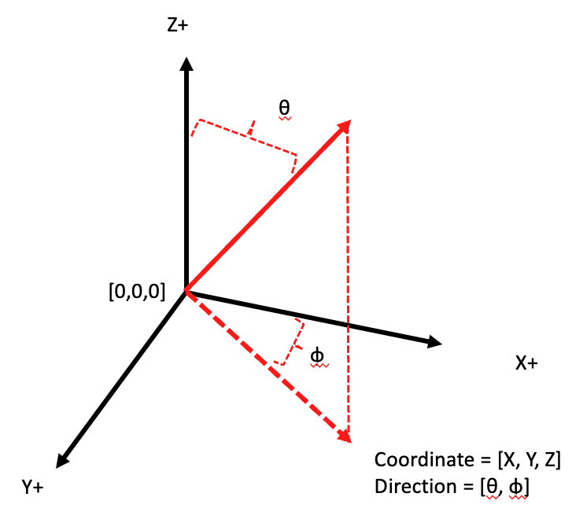

# Overview

## T-Mart: Topography-adjusted Monte-carlo Adjacency-effect Radiative Transfer Code


T-Mart solves the radiative transfer in a 3D ocean-atmosphere system through a Monte-Carlo approach. T-Mart features arbitrary surface models which allow simulations of the adjacnecy effect in aquatic remote sensing. 

In addition to the radiative transfer solver, there are three components in the code: atmosphere, water and land: 

- The atmosphere consists of layers with various scattering and absorbing properties and shares the same atmosphere and aerosol databases with 6S.  
- Land is treated as Lambertian. The topography of land is modelled by triangulating the pixels of an input DEM. 
- Water has three components: 1) water-leaving reflectance, 2) white-caps and 3) glint reflectance. 1 and 2 are assumed to be Lambertian, 3 is calculated through Cox-Munk slope statistics. 

Many of T-Mart's input are from Py6S. Users are assumed to have basic understanding of numpy arrays and radiative transfer. 

Home page: <a href="https://github.com/yulunwu8/tmart" target="_blank">https://github.com/yulunwu8/tmart</a>

Yulun Wu | April 2, 2023 | [yulunwu8@gmail.com](mailto:yulunwu8@gmail.com)

## Publication

Wu, Y., Knudby, A., & Lapen, D. (2023). Topography-Adjusted Monte Carlo Simulation of the Adjacency Effect in Remote Sensing of Coastal and Inland Waters. *Journal of Quantitative Spectroscopy and Radiative Transfer*, 108589. <a href="https://doi.org/10.1016/j.jqsrt.2023.108589" target="_blank">https://doi.org/10.1016/j.jqsrt.2023.108589</a>

## Required Libraries

T-Mart is written in Python 3, and it requires Py6S, numpy, pandas, scipy, pathos, matplotlib, and netCDF4.


## Installation 

1 - Create a conda environment and activate it: 
```
conda create --name tmart python=3.9
conda activate tmart
```

2 - Install dependencies: 
```
conda install -c conda-forge Py6S numpy pandas scipy pathos matplotlib netCDF4
```

3 - Install tmart: 
```
pip3 install tmart
```


## Input

**Essential inputs**

- Wavelength: wavelength in nm.
- Surface: 
	- DEM: Digital Elevation Model, the elevation of pixels in a run.
	- Cell size: the width and length of each pixel. 
	- Reflectance: reflectance of land or water-leaving reflectance of water, assumed to be Lambertian. 
	- is_water: specify which pixels are water pixels. 
	- Background information: the elevation and reflectance of the background beyond the range of the pixels.

- Atmosphere profile: choose from Py6S. 

- n_photon: number of photons used in each run, default 10,000. A greater value (e.g., 100,000) makes the run slower but with higher accuracy.
- Geometry: photon starting position, solar angle, viewing angle. 


**Optional inputs**

- Atmosphere: 
 	- AOT550: aerosol optical thickness at 550nm.
	- Aerosol model: choose from Py6S
	- Aerosol scale height: default 2 km.
	- n_layers: number of atmospheric layers: default 10. Having more layers may slightly increases the computation time
- Water: 
	- Wind: wind speed and direction 
	- Water salinity: in unit of parts per thousand, default 0.
	- Water temperature: in Celsius, default 25.


**Geometry**
 
 The geometry in T-Mart follows the diagram below.
 
 



## Output 

Reflectances (definitions following 6S):

- Atmospheric intrinsic reflectance
- Environmental reflectance 
- Direct reflectance

Environmental and direct reflectances can be further divided into contributions from water-leaving, water-specular, water-whitecap and land reflectances. 


